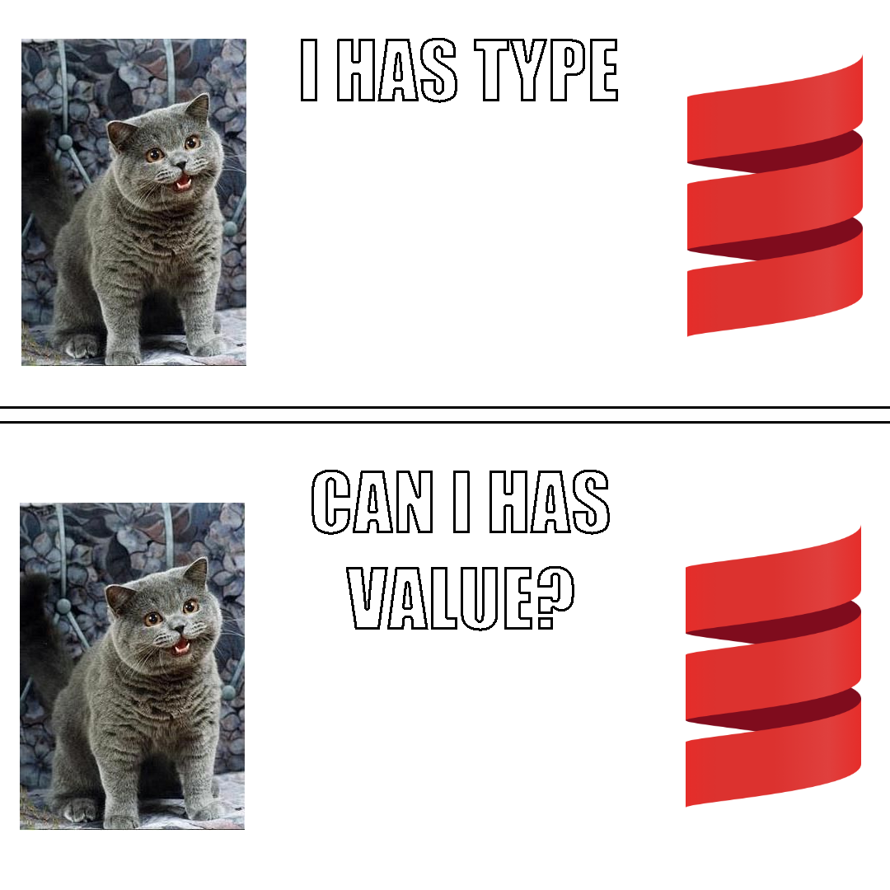

# Demystifying Scala Implicits

---

## The Idea



---

## Kinds of Implicits

- implicit declarations
- implicit parameters
- views (implicit conversions)
- implicit classes

---

## Scope of This Presentation

- implicit declarations
- implicit parameters
- ~~views (implicit conversions)~~
- ~~implicit classes~~
- **Implicit Resolution**

---

## Simple Example

```scala
trait ToJson[A] {
  
  def jsonify(a: A): String
}

implicit val intToJson: ToJson[Int] = i => i.toString
implicit val stringToJson: ToJson[String] = s => "\"" + s + "\""

implicitly[ToJson[Int]].jsonify(1)
implicitly[ToJson[String]].jsonify("I like cats.")

def listToJson[A](as: List[A])(implicit aToJson: ToJson[A]): String =
	as.map(a => aToJson.jsonify(a)).mkString("[", ", ", "]")


listToJson(List(1, 2, 3, 4))
listToJson(List("I", "really", "like", "cats"))
```

Try [it](https://scastie.scala-lang.org/7XcIi4vIRGmzz3KZO8w3KQ) out!